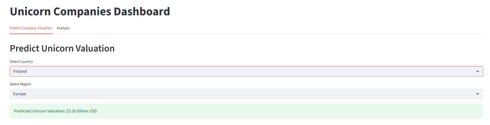
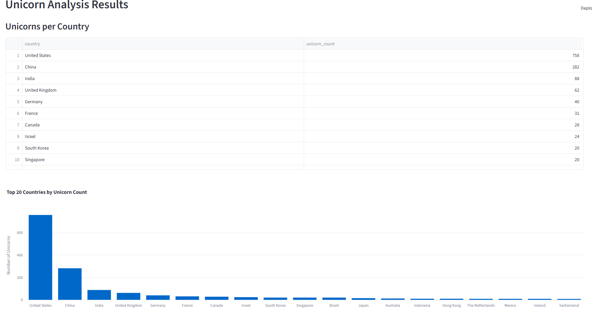
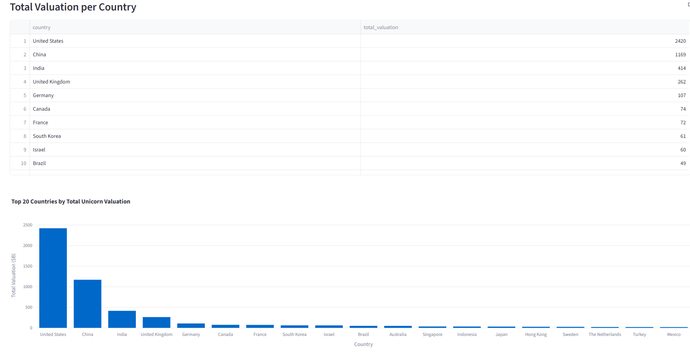
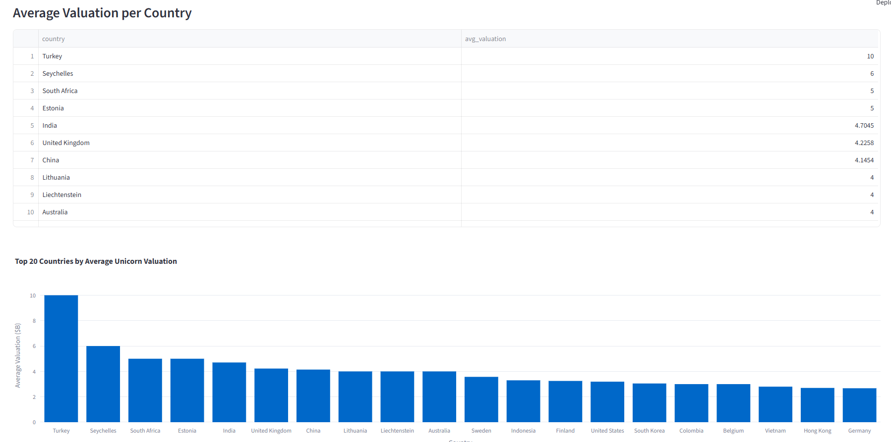
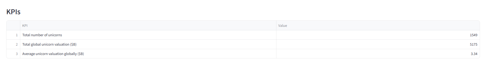

# 🦄 Unicorn Companies Analysis Dashboard

Analyze global unicorn companies, explore key metrics, and predict expected valuations using an interactive Streamlit dashboard.

## ✅ Tools Used

- Python 3.11  
- SQLite  
- pandas  
- scikit-learn  
- Streamlit  
- Plotly

## 📦 How to Use

**1️⃣ Clone the repository:**

git clone https://github.com/kacperguzydev/Unicorn_Companies_Analysis.git

**2️⃣ Install required packages:**

pip install -r requirements.txt

**3️⃣ Prepare the data (run these scripts in order):**

- python models/transform.py
- python models/load_to_db.py
- python models/sql_analysis.py
- python models/regression_prediction.py

**4️⃣ Launch the dashboard locally:**

streamlit run dashboard.py

## 🚀 Screenshots
- 🔮 Prediction Tab:

- 📊 Analysis: Unicorns per Country:

- 💰 Analysis: Total Valuation per Country:

- 📉 Analysis: Average Valuation per Country:

- 📈 Analysis: KPIs Overview:
  
